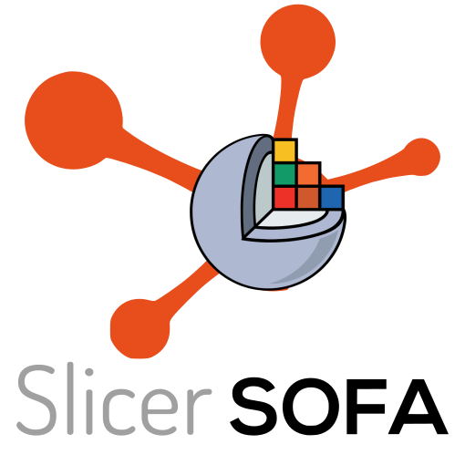
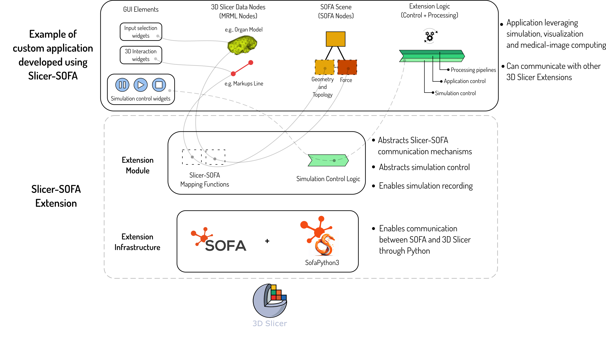

# Slicer-SOFA

## Introduction

Slicer-SOFA is an open-source extension that seamlessly integrates the SOFA into 3D Slicer, a versatile platform for medical image analysis and visualization. This integration facilitates the development and execution of complex biomechanical models, enhancing applications in surgical planning, medical training, and biomedical research. By combining the strengths of both platforms, Slicer-SOFA aims to advance the field of medical simulation and provide a comprehensive tool for clinicians, researchers, and educators. This software is distributed under a MIT License.

## Software Architecture

The **Slicer-SOFA Extension** bridges the capabilities of the open-source 3D Slicer platform and the **SOFA Framework**, enabling advanced simulation-based applications. This integration leverages Slicer's Python environment and **SofaPython3**, providing a seamless interface between Slicer and SOFA. 

### 1. Fundamental Infrastructure Level
At this level, the SOFA Framework and SofaPython3 are integrated directly into 3D Slicer. This allows Slicer users and developers to interact with SOFA's robust simulation capabilities through the SofaPython3 API. The integration builds the foundation for simulation-based workflows and enables the use of SOFA's extensive toolset within the Slicer environment ([Learn more about 3D Slicer architecture on the Slicer ReadTheDocs page](https://slicer.readthedocs.io/en/latest/)).

### 2. Scripted Module Infrastructure Level
On top of the core integration, Slicer-SOFA provides an infrastructure for developing simulation-based Slicer extensions. This includes:
- **Data Interchange:** Utilities for seamless data conversion between Slicer MRML nodes (e.g., volumes, markups) and SOFA objects. This supports end-to-end communication from application widgets in Slicer to simulation parameters in SOFA ([Explore MRML and data handling on Slicer ReadTheDocs](https://slicer.readthedocs.io/en/latest/developer_guide/mrml.html))
- **Simulation Lifecycle Management:** Tools for controlling the lifecycle of SOFA simulations directly from Slicer.
- **Recording and Playback:** Integration with Slicer's **Sequences Module**, enabling the recording and replay of simulations ([Learn more about Slicer's Sequences Module](https://slicer.readthedocs.io/en/latest/user_guide/modules/sequences.html))

These two levels of integration empower developers to create sophisticated, simulation-based applications while maintaining the user-friendly and modular environment that Slicer offers.
