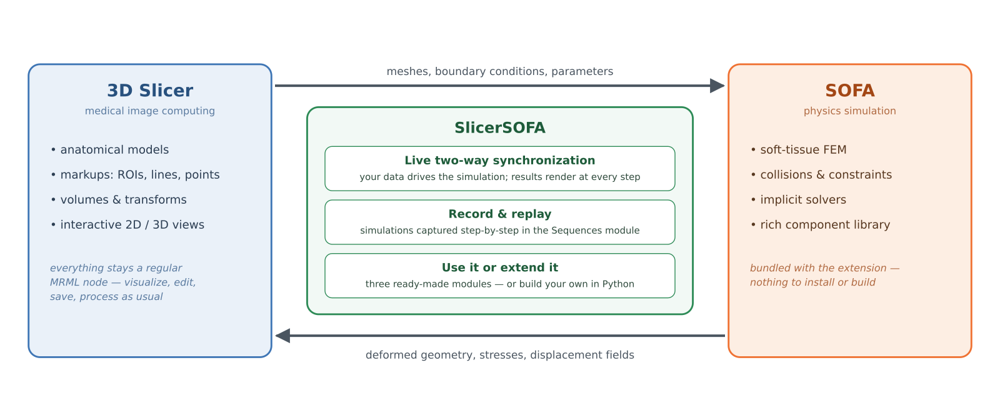

SlicerSOFA documentation
========================

**SlicerSOFA** is a `3D Slicer <https://www.slicer.org/>`_ extension that
integrates the `SOFA simulation framework <https://www.sofa-framework.org/>`_
into Slicer, enabling physics-based simulation — soft tissue deformation,
biomechanical modeling — inside a medical imaging platform.

.. toctree::
   :maxdepth: 2
   :caption: Getting started

   pages/overview
   pages/installation

.. toctree::
   :maxdepth: 2
   :caption: User guide

   pages/softtissue-simulation
   pages/sparsegrid-simulation
   pages/sofasceneloader

.. toctree::
   :maxdepth: 2
   :caption: Developer guide

   pages/architecture
   pages/module-development
   pages/mappings-reference
   pages/building
   pages/testing

.. toctree::
   :maxdepth: 1
   :caption: Reference

   pages/limitations
   pages/resources
