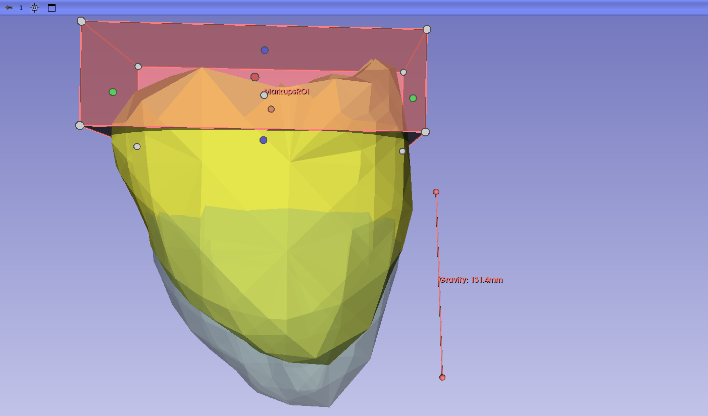

Soft Tissue Simulation
======================

Overview
--------

The **Soft Tissue Simulation** module (category *Examples*) demonstrates a
complete SlicerSOFA workflow: a tetrahedral organ model is loaded as an MRML
model node, deformed by a gravity force in a SOFA FEM simulation, and updated
live in Slicer's 3D view — including per-element von Mises stress that can be
color-mapped onto the model.

The SOFA scene built by the module contains:

- a ``TetrahedronFEMForceField`` (corotational FEM, ``computeVonMisesStress``
  enabled) over the input tetrahedral mesh,
- a ``BoxROI`` + ``FixedConstraint`` that pins the vertices inside the
  user-placed boundary ROI,
- a triangle-surface collision model derived from the tetrahedral mesh,
- a ``FreeMotionAnimationLoop`` with a Gauss-Seidel constraint solver.

Step-by-step usage
------------------

1. Load the sample model: **Sample Data** module → *SOFA* category →
   *RightLungLowTetra* (or load your own model containing a
   ``vtkUnstructuredGrid`` of tetrahedra).
2. Open **Examples → Soft Tissue Simulation**.
3. Select the model in the **Model Node** selector.
4. Click the **+** button next to **Boundary ROI** to create an ROI fitted to
   the model bounds, then adjust it to cover the region that should stay
   fixed (e.g. the top of the lung).
5. Click the **+** button next to **Gravity Vector** to create a line markup,
   orient it to point in the desired direction of gravity, and set the
   gravity magnitude.
6. Optionally adjust ``dt`` (default 0.01) and the number of steps
   (``-1`` runs indefinitely), and enable **Record sequence** to capture the
   simulation into a sequence browser.
7. Click **Start Simulation**. Stop with **Stop Simulation**; **Reset
   Simulation** restores the model's original (undeformed) geometry.

Visualizing stress
------------------

During the simulation the module writes a ``VonMisesStress`` cell-data array
into the model. To see it, open the **Models** module, select the model, and
under *Scalars* enable visibility and choose ``VonMisesStress``.

Parameter node
--------------

The module's parameter node (``SoftTissueSimulationParameterNode``) holds:

.. list-table::
   :header-rows: 1
   :widths: 25 25 50

   * - Field
     - Type
     - Role
   * - ``modelNode``
     - ``vtkMRMLModelNode``
     - Tetrahedral mesh to simulate; receives deformed geometry and stress.
   * - ``boundaryROI``
     - ``vtkMRMLMarkupsROINode``
     - Region whose vertices are fixed during simulation.
   * - ``gravityVector``
     - ``vtkMRMLMarkupsLineNode``
     - Direction of the gravity force.
   * - ``gravityMagnitude``
     - ``int``
     - Magnitude applied along the (normalized) gravity vector.
   * - ``recordSequence``
     - ``bool``
     - Record the mapped nodes into a sequence browser, one frame per step.
   * - ``dt``, ``totalSteps``, ``currentStep``, ``isSimulationRunning``, ``simulationProgress``
     - *(injected)*
     - Standard simulation controls added by ``SofaParameterNodeWrapper``.

Recording
---------

With **Record sequence** enabled, starting the simulation creates a
*SOFA Simulation Browser* sequence browser node with one sequence per mapped
node (model, ROI, gravity vector). Exactly one frame is recorded per executed
simulation step, so the recorded frame count is deterministic and the last
frame equals the final simulation state. Use the **Sequences** module to
replay the simulation.
