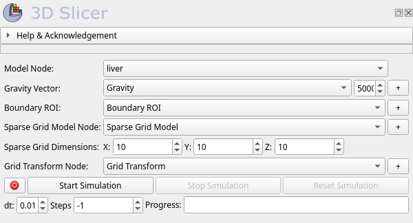
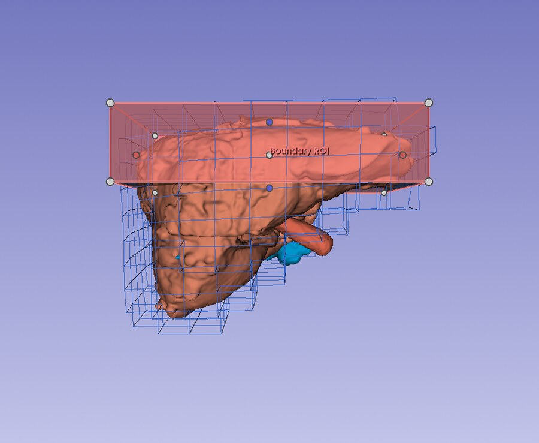

Sparse Grid Simulation
======================

Overview
--------

The **Sparse Grid Simulation** module (category *Examples*) deforms a surface
model by embedding it in a sparse hexahedral grid (SOFA's
``SparseGridTopology``) and simulating that grid with a hexahedral FEM force
field. Its distinguishing feature is the output: besides updating the surface
model, it resamples the simulated displacement field onto a regular grid and
publishes it as a ``vtkMRMLGridTransformNode`` — a standard MRML transform
that can be applied to (or hardened on) volumes, segmentations, and other
nodes in the scene.

Step-by-step usage
------------------

1. Load the sample scene: **Sample Data** module → *SOFA* category →
   *LiverSimulationScene* (or load your own closed surface model).
2. Open **Examples → Sparse Grid Simulation**.
3. Select the surface model in the **Model Node** selector.
4. Click the **+** button next to **Boundary ROI** to create an ROI fitted to
   the model bounds and place it over the region to fix.
5. Click the **+** button next to **Gravity Vector** and orient the line; set
   the gravity magnitude.
6. Click the **+** button next to **Sparse Grid Model Node** — this creates
   the model node that receives the simulated hexahedral grid and its
   ``Displacement`` point-data array.
7. Click the **+** button next to **Grid Transform Node** — this creates the
   grid transform that the module updates during the simulation.
8. Set the **Sparse Grid Dimensions** (default 10 × 10 × 10) if needed, then
   click **Start Simulation**.
9. To deform other data along with the model, apply the grid transform to it
   (**Transforms** module), or harden the transform once the simulation
   reaches the desired state.

A liver surface after 300 steps under gravity: the top of the organ is held
by the boundary ROI while the rest sags, and the embedding sparse hexahedral
grid (wireframe) deforms with it.

The displacement grid transform
-------------------------------

On every simulation step the module:

1. reads the displacement of each sparse-grid vertex from SOFA
   (``position − rest_position``),
2. probes this field over the grid's *rest* (undeformed) configuration on a
   regular lattice matching the sparse grid dimensions,
3. writes the result into the grid transform's displacement grid as the
   **TransformToParent**.

Sampling over the rest configuration makes the transform a true function of
the undeformed coordinate ("where did the point at *x* move to?"), and
providing *TransformToParent* directly avoids numerical inversion of the
field near steep displacement gradients.

Reproducibility
---------------

The module runs the SOFA solver single-threaded by default
(``DETERMINISTIC_SOLVER = True`` in ``SparseGridSimulation.py``). SOFA's
parallel components sum forces in a non-deterministic order, which measurably
changes the sampled displacement between byte-identical runs; on meshes of
this size the parallelism buys ~2% of wall time, so determinism wins. Set the
constant to ``False`` for meshes large enough that threading pays off,
accepting run-to-run variability.

Parameter node
--------------

.. list-table::
   :header-rows: 1
   :widths: 25 25 50

   * - Field
     - Type
     - Role
   * - ``modelNode``
     - ``vtkMRMLModelNode``
     - Input surface model; receives the deformed surface each step.
   * - ``boundaryROI``
     - ``vtkMRMLMarkupsROINode``
     - Region whose grid vertices are fixed.
   * - ``gravityVector``
     - ``vtkMRMLMarkupsLineNode``
     - Direction of the gravity force.
   * - ``sparseGridModelNode``
     - ``vtkMRMLModelNode``
     - Receives the hexahedral sparse grid and its ``Displacement`` array.
   * - ``gridTransformNode``
     - ``vtkMRMLGridTransformNode``
     - Receives the resampled displacement field (TransformToParent).
   * - ``gravityMagnitude``
     - ``float``
     - Magnitude applied along the (normalized) gravity vector.
   * - ``sparseGridDimensions``
     - ``GridDimensions`` (x, y, z)
     - Resolution of the sparse grid and of the displacement grid
       (10 × 10 × 10 by default).
   * - ``recordSequence``
     - ``bool``
     - Record the mapped nodes (including the grid transform) per step.

Recording
---------

With **Record sequence** enabled, the surface model, sparse grid model,
boundary ROI, gravity vector, and — most usefully — the grid transform are
recorded into a sequence browser, one frame per simulation step. The recorded
grid transform sequence is what downstream processing typically consumes
(e.g. resampling a volume at a chosen time point).
